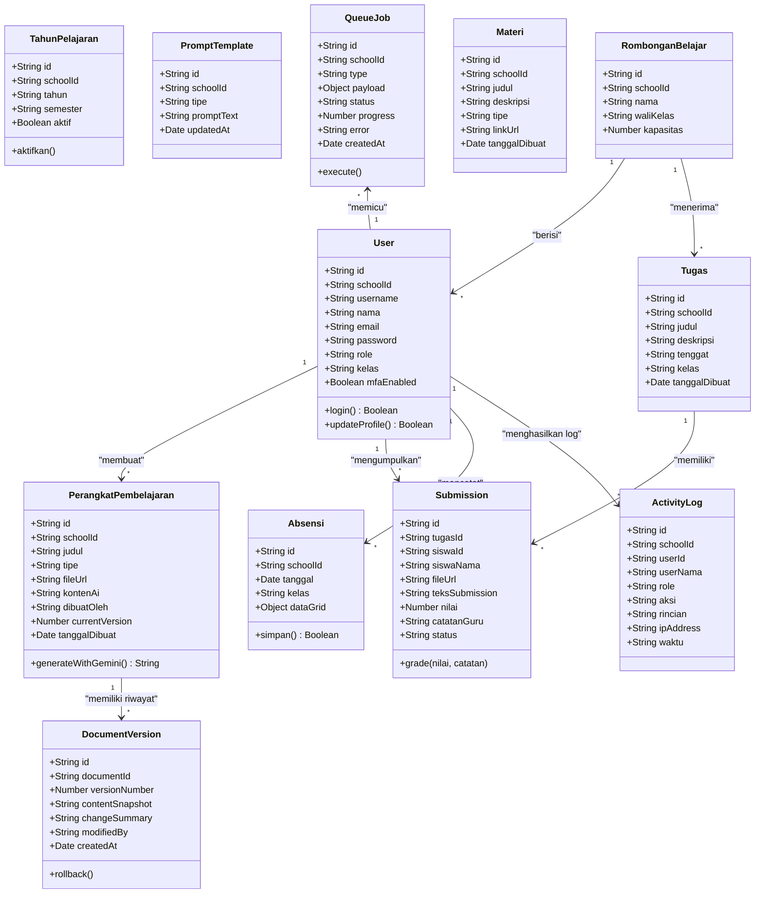
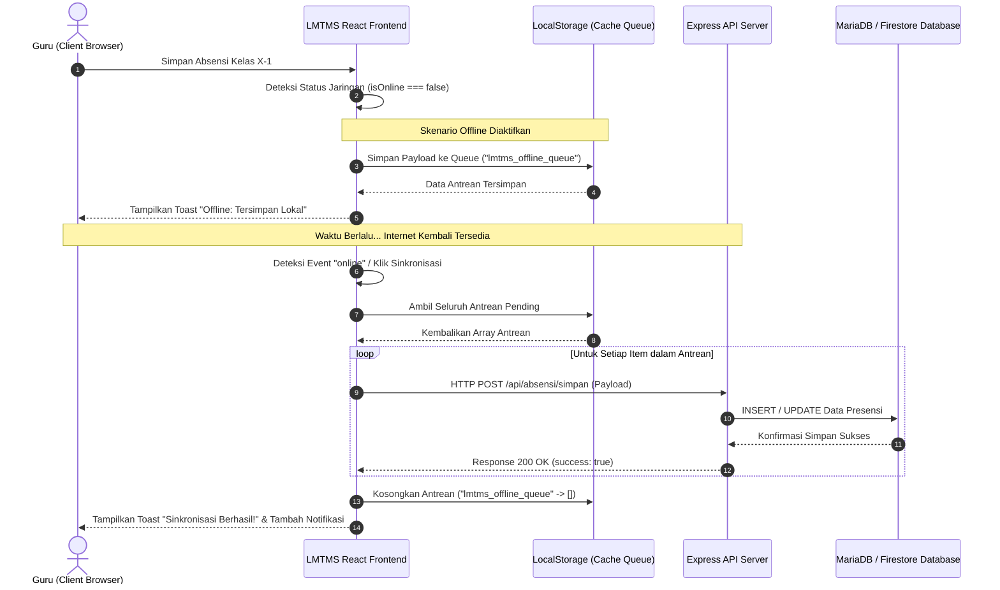
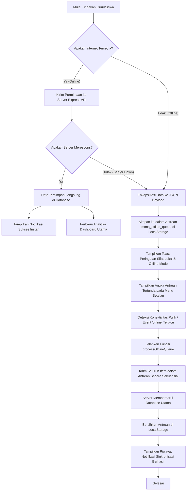
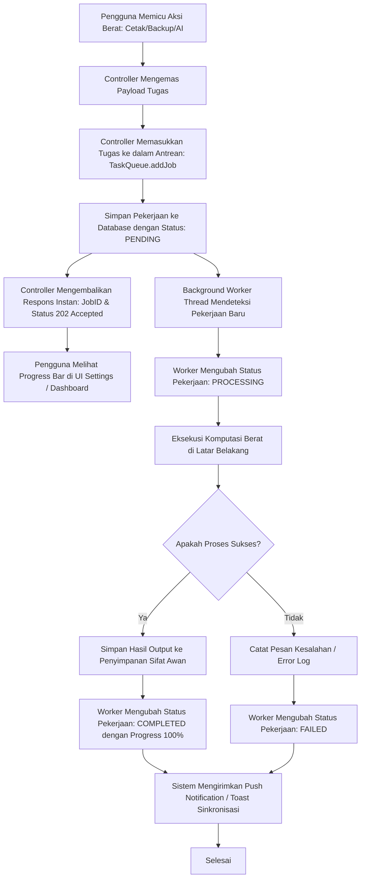
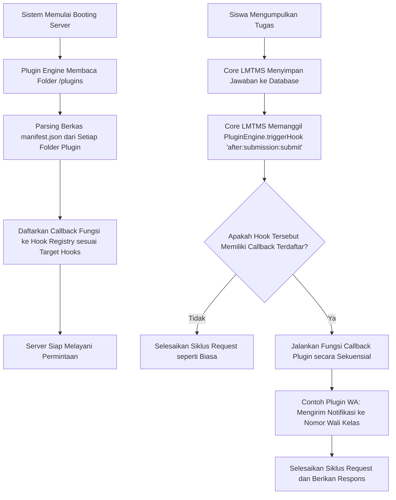
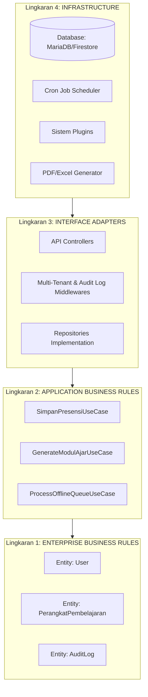

# Arsitektur Sistem LMTMS (UML & Flowchart)

Dokumen ini menjelaskan rancangan sistem terpadu **LMTMS (Informatika SMA)** melalui diagram UML (*Unified Modeling Language*) dan Alur Kerja (*Flowchart*) interaktif berbasis Mermaid.

---

## 1. Diagram UML (Unified Modeling Language)

### 1.1 Use Case Diagram
Diagram use case berikut mendefinisikan batasan peran (Role-Based Access Control) antara aktor: **Administrator**, **Guru**, dan **Siswa** di dalam Portal LMTMS.

```mermaid
usecaseDiagram
    actor Administrator as "Administrator (Tata Usaha)"
    actor Guru as "Guru Informatika"
    actor Siswa as "Siswa"

    %% Administrator Use Cases
    Administrator --> (Login & Autentikasi Keamanan)
    Administrator --> (Kelola Akun Guru & Siswa)
    Administrator --> (Kelola Tahun Pelajaran & Semester)
    Administrator --> (Kelola Rombongan Belajar / Kelas)
    Administrator --> (Kelola Kalender Akademik Sekolah)
    Administrator --> (Pantau Log Aktivitas Server)

    %% Guru Use Cases
    Guru --> (Login & Autentikasi Keamanan)
    Guru --> (Buat Rencana Pembelajaran / Perangkat)
    Guru --> (Gunakan AI Assistant & Draft Otomatis)
    Guru --> (Terbitkan Materi Pembelajaran)
    Guru --> (Kelola Presensi Kehadiran Kelas)
    Guru --> (Buat & Berikan Penilaian Tugas)
    Guru --> (Lihat Analitika & Grafik Statistik)

    %% Siswa Use Cases
    Siswa --> (Login & Autentikasi Keamanan)
    Siswa --> (Lihat Jadwal Pelajaran & Kalender)
    Siswa --> (Akses Materi Pembelajaran Mandiri)
    Siswa --> (Unggah Pengumpulan Tugas / Kuis)
    Siswa --> (Lihat Hasil Rekap Penilaian)
    Siswa --> (Presensi secara Otomatis)
```

---

### 1.2 Class Diagram (UML)
Class diagram di bawah menggambarkan struktur entitas data utama di sistem LMTMS serta relasi asosiasi satu dengan lainnya.



---

### 1.3 Sequence Diagram (Proses Sinkronisasi Absensi Offline)
Sequence diagram berikut memvisualisasikan interaksi komponen ketika Guru mengisi lembar presensi dalam keadaan tanpa koneksi internet (Offline), dan bagaimana data disinkronkan kembali saat terhubung ke server.



---

## 2. Alur Kerja (Flowchart)

### 2.1 Alur Deteksi Jaringan & Pengambilan Tindakan PWA
Flowchart ini mengilustrasikan logika internal aplikasi LMTMS dalam mengambil keputusan penyimpanan data berdasarkan status ketersediaan koneksi internet.



---

### 2.2 Alur Pemrosesan Tugas pada Sistem Antrean (Heavy Task Queue Flow)
Alur ini menjelaskan bagaimana proses kompilasi PDF besar, backup database otomatis, dan generate modul ajar diproses secara asinkron di background thread.



---

### 2.3 Alur Mekanisme Ekstensi Plugin (Plugin Hooks Flow)
Bagan ini menunjukkan bagaimana plugin pihak ketiga memodifikasi atau memperluas alur bisnis aplikasi LMTMS melalui Hook Registry.



---

### 2.4 Struktur Batasan Clean Architecture (Clean Architecture Boundaries)
Representasi aliran ketergantungan arah dalam (*inside dependency rule*) pada implementasi LMTMS.



